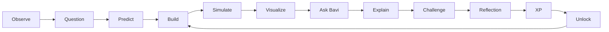
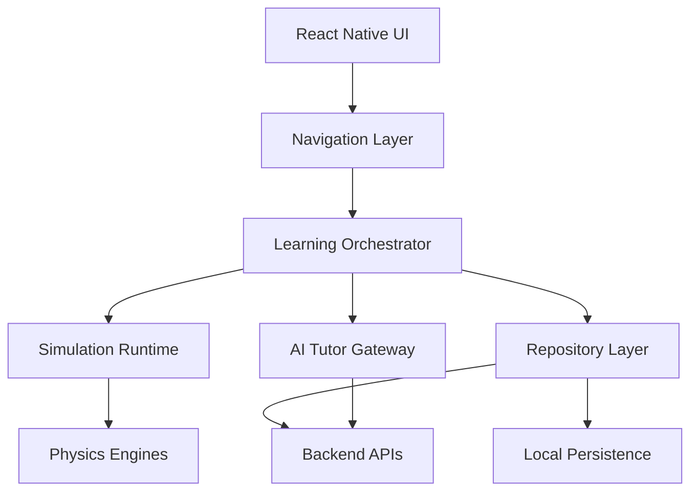
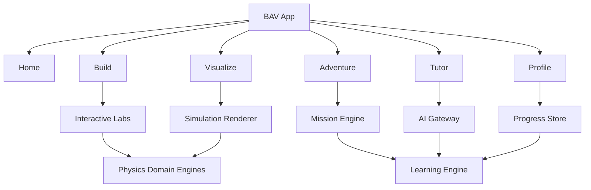
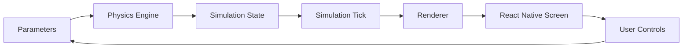
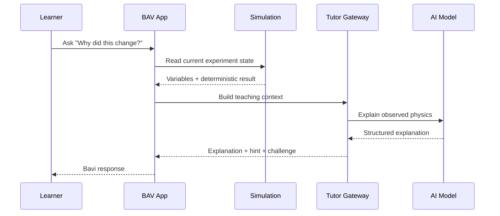
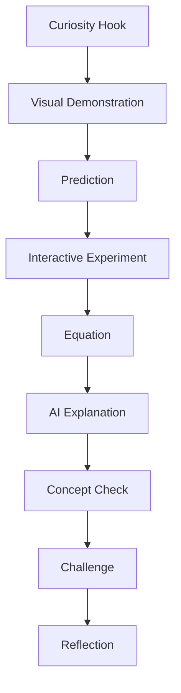
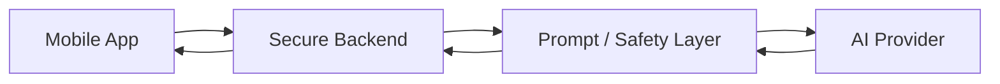
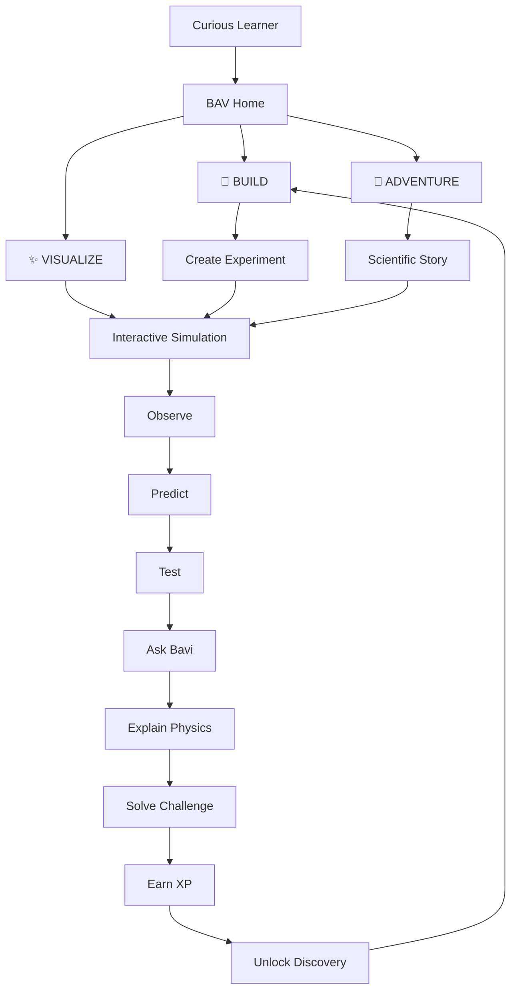

# B.A.V. — Brilliant Adventures in Physics

> **Turn Curiosity Into Discovery.**

B.A.V. is an AI-powered, interactive physics learning platform designed to make physics feel like exploration rather than homework.

The product is built around three pillars:

* **B — Build 🧩** — build experiments, circuits, particle systems, wave systems, molecular models, and physics worlds.
* **A — Adventure 🚀** — progress through missions, stories, challenges, discoveries, and scientific quests.
* **V — Visualize ✨** — turn equations and invisible physical phenomena into interactive simulations and animations.


B.A.V. connects classical physics with quantum physics, atomic and molecular physics, nuclear physics, particle physics, optics, electronics, condensed matter, biophysics, astrophysics, and cosmology.

---

## Table of Contents

1. [Vision](#vision)
2. [Why BAV](#why-bav)
3. [Core Product Loop](#core-product-loop)
4. [Feature Overview](#feature-overview)
5. [Technical Architecture](#technical-architecture)
6. [Application Architecture](#application-architecture)
7. [React Native Stack](#react-native-stack)
8. [Physics Engine Architecture](#physics-engine-architecture)
9. [Simulation Architecture](#simulation-architecture)
10. [AI Tutor Architecture](#ai-tutor-architecture)
11. [Build Pillar](#build-pillar)
12. [Adventure Pillar](#adventure-pillar)
13. [Visualize Pillar](#visualize-pillar)
14. [Quantum Physics](#quantum-physics)
15. [Atomic and Molecular Physics](#atomic-and-molecular-physics)
16. [Nuclear and Particle Physics](#nuclear-and-particle-physics)
17. [Optics and Light–Matter](#optics-and-lightmatter)
18. [Electronics](#electronics)
19. [Condensed Matter](#condensed-matter)
20. [Biophysics](#biophysics)
21. [Astronomy and Cosmology](#astronomy-and-cosmology)
22. [Educational Design](#educational-design)
23. [Gamification](#gamification)
24. [Data Model](#data-model)
25. [Navigation](#navigation)
26. [Animation System](#animation-system)
27. [Performance](#performance)
28. [Accessibility](#accessibility)
29. [Internationalization](#internationalization)
30. [Testing](#testing)
31. [Security and AI Safety](#security-and-ai-safety)
32. [Monetization](#monetization)
33. [Analytics Philosophy](#analytics-philosophy)
34. [Development Workflow](#development-workflow)
35. [Project Structure](#project-structure)
36. [Example Code](#example-code)
37. [Roadmap](#roadmap)
38. [Contribution Guide](#contribution-guide)
39. [License](#license)
40. [Final Product Vision](#final-product-vision)

---

# Vision

B.A.V. is intended to become a **physics universe** that learners can enter rather than a digital textbook they have to finish.

Traditional physics applications tend to focus on one of three experiences:

1. formula lookup,
2. video lessons,
3. question banks.

B.A.V. combines those experiences with a fourth layer:

> **interactive scientific exploration.**

A learner should be able to move from a question such as:

> “Why does an orbit change when velocity changes?”

into a live experiment:

```text
Question
   │
   ▼
Choose Variables
   │
   ▼
Build Experiment
   │
   ▼
Run Simulation
   │
   ▼
Observe Result
   │
   ▼
Ask Bavi Why?
   │
   ▼
Explain Physics
   │
   ▼
Solve Challenge
   │
   ▼
Earn XP
   │
   ▼
Unlock Next Discovery
```

The objective is not merely to provide the correct answer. The objective is to help the learner develop a mental model of why the answer works.

---

# Why BAV

## The B.A.V. Framework

### Build 🧩

The learner manipulates a physical system instead of passively reading about it.

Examples:

* Build a gravity system.
* Build an electric circuit.
* Build a molecular model.
* Build an orbital system.
* Build a wave.
* Build a quantum circuit.
* Build a crystal lattice.

### Adventure 🚀

Physics becomes a sequence of discoveries.

Examples:

* Repair a spacecraft using orbital mechanics.
* Identify a mystery star using spectroscopy.
* Decode a particle event.
* Design an optical instrument.
* Investigate an unexplained signal.
* Explore the birth of a galaxy.

### Visualize ✨

The app translates mathematical relationships into motion.

Examples:

* vectors become arrows,
* electric fields become field lines,
* wavefunctions become curves,
* atoms become orbital probability clouds,
* circuits become animated current paths,
* planets become orbital systems,
* galaxies become dynamic structures.

---

# Core Product Loop



The loop intentionally separates **prediction** from **observation**. Learners should have an opportunity to form a hypothesis before seeing the simulation result.

---

# Feature Overview

| Area             | Capabilities                                              |
| ---------------- | --------------------------------------------------------- |
| Mechanics        | Motion, force, momentum, energy, gravity, orbits          |
| Waves            | Oscillations, interference, diffraction, resonance        |
| Thermodynamics   | Temperature, heat, entropy, heat engines                  |
| Electricity      | Charge, electric fields, potential, current               |
| Electronics      | Resistors, capacitors, inductors, diodes, transistors     |
| Optics           | Reflection, refraction, lenses, mirrors, diffraction      |
| Quantum          | States, wavefunctions, uncertainty, tunneling, qubits     |
| Atomic           | Energy levels, orbitals, spectroscopy, transitions        |
| Molecular        | Bonds, vibration, rotation, dipole moments                |
| Nuclear          | Isotopes, binding energy, decay, fusion, fission          |
| Particle         | Quarks, leptons, bosons, relativistic energy              |
| Condensed Matter | Lattices, phonons, bands, Fermi-Dirac statistics          |
| Biophysics       | Diffusion, membranes, neurons, DNA, molecular motors      |
| Astronomy        | Stars, planets, galaxies, black holes                     |
| Cosmology        | Expansion, CMB, dark matter, dark energy, cosmic history  |
| AI               | Tutoring, hints, explanations, misconceptions, challenges |
| Gamification     | XP, levels, missions, badges, streaks                     |
| Storytelling     | Chapters, characters, scientific quests                   |

---

# Technical Architecture

B.A.V. separates presentation, simulation, domain physics, learning orchestration, AI, and persistence.



## Architectural Principles

### Domain isolation

Each major physics field has its own module. This prevents a large monolithic physics engine from becoming impossible to maintain.

### Deterministic simulation

Educational simulations should be deterministic whenever possible.

Given the same inputs:

```text
same parameters
      ↓
same model
      ↓
same timestep
      ↓
same output
```

This helps students reproduce experiments and makes automated tests practical.

### AI as an explainer, not a physics authority

Numerical physical models should live in deterministic code whenever feasible. The AI layer explains, coaches, scaffolds, and asks questions around those results.

---

# Application Architecture



---

# React Native Stack

A practical implementation can use:

```text
React Native
TypeScript
Expo or React Native CLI
React Navigation
Zustand
React Native Reanimated
React Native Gesture Handler
React Native SVG
SQLite / local persistence
Secure storage
Optional backend API
AI provider gateway
```

The application should remain modular enough that the rendering layer can evolve without rewriting physics logic.

Example folder structure:

```text
src/
├── app/
│   ├── navigation/
│   ├── providers/
│   └── theme/
│
├── bav/
│   ├── BAVBrand.ts
│   ├── BAVTypes.ts
│   ├── BAVStore.ts
│   └── BAVNavigator.tsx
│
├── physics/
│   ├── mechanics/
│   ├── waves/
│   ├── thermodynamics/
│   ├── electricity/
│   ├── electronics/
│   ├── optics/
│   ├── quantum/
│   ├── atomic/
│   ├── molecular/
│   ├── nuclear/
│   ├── particle/
│   ├── condensedMatter/
│   ├── biophysics/
│   ├── astronomy/
│   └── cosmology/
│
├── simulations/
│   ├── runtime/
│   ├── timestep/
│   ├── collisions/
│   ├── particles/
│   ├── waves/
│   └── experiments/
│
├── ai/
│   ├── gateway/
│   ├── tutor/
│   ├── hints/
│   ├── misconceptions/
│   └── prompts/
│
├── learning/
│   ├── lessons/
│   ├── missions/
│   ├── quests/
│   ├── challenges/
│   └── progression/
│
├── components/
│   ├── bav/
│   ├── physics/
│   ├── simulations/
│   └── education/
│
└── screens/
    ├── home/
    ├── build/
    ├── adventure/
    ├── visualize/
    ├── tutor/
    └── profile/
```

---

# Physics Engine Architecture

Each domain exposes calculations through a predictable interface.

```ts
export interface PhysicsEngine<TInput, TOutput> {
  simulate(input: TInput): TOutput;
  validate(input: TInput): string[];
}
```

Example:

```ts
export interface ProjectileInput {
  velocity: number;
  angleRadians: number;
  gravity: number;
  time: number;
}

export interface ProjectileOutput {
  x: number;
  y: number;
  vx: number;
  vy: number;
}
```

```ts
export class ProjectileEngine
  implements PhysicsEngine<ProjectileInput, ProjectileOutput> {

  simulate(input: ProjectileInput): ProjectileOutput {
    const vx =
      input.velocity * Math.cos(input.angleRadians);

    const vy =
      input.velocity * Math.sin(input.angleRadians) -
      input.gravity * input.time;

    return {
      x: vx * input.time,
      y:
        input.velocity *
          Math.sin(input.angleRadians) *
          input.time -
        0.5 * input.gravity * input.time ** 2,
      vx,
      vy
    };
  }

  validate(input: ProjectileInput): string[] {
    const errors: string[] = [];

    if (input.velocity < 0) {
      errors.push("Velocity cannot be negative.");
    }

    if (input.gravity < 0) {
      errors.push("This model expects non-negative gravity magnitude.");
    }

    return errors;
  }
}
```

---

# Simulation Architecture

Simulation code should be independent of UI components.



A simulation state can look like:

```ts
export interface SimulationState {
  time: number;
  running: boolean;
  speed: number;
  frame: number;
  values: Record<string, number>;
}
```

Use a fixed or controlled timestep for educational simulations whenever appropriate.

```ts
export function advanceTime(
  state: SimulationState,
  dt: number
): SimulationState {
  if (!state.running) return state;

  return {
    ...state,
    time: state.time + dt,
    frame: state.frame + 1
  };
}
```

---

# AI Tutor Architecture

Bavi is the AI mentor inside the B.A.V. experience.



The AI gateway should normalize provider responses so the application does not depend on a specific model provider.

```ts
export interface TutorGateway {
  explain(
    request: TutorRequest
  ): Promise<TutorResponse>;
}

export interface TutorRequest {
  concept: string;
  question: string;
  learnerLevel: "beginner" | "intermediate" | "advanced";
  variables: Record<string, number>;
  observedResult?: string;
}

export interface TutorResponse {
  intuition: string;
  explanation: string;
  equation?: string;
  hint?: string;
  challenge?: string;
}
```

## AI teaching policy

Bavi should:

* explain before evaluating,
* ask questions instead of always giving answers,
* connect equations to visual behavior,
* identify misconceptions gently,
* adjust explanation depth,
* distinguish idealized models from real-world systems,
* avoid fabricated measurements,
* respect uncertainty when a model is approximate.

---

# Build Pillar

Build is the creative laboratory of B.A.V.

## Build categories

```text
BUILD
├── Mechanics
├── Gravity
├── Waves
├── Electricity
├── Electronics
├── Optics
├── Quantum
├── Molecules
├── Atoms
├── Nuclei
├── Particles
├── Materials
├── Biophysics
├── Astronomy
└── Cosmology
```

## Generic experiment builder

```ts
export interface ExperimentDefinition {
  id: string;
  title: string;
  domain: string;
  parameters: PhysicsParameter[];
  objective: string;
}

export interface PhysicsParameter {
  id: string;
  label: string;
  symbol: string;
  value: number;
  min: number;
  max: number;
  step: number;
  unit: string;
}
```

## Build flow

```text
Choose experiment
       ↓
Place objects
       ↓
Configure variables
       ↓
Predict outcome
       ↓
Run experiment
       ↓
Inspect visualization
       ↓
Save experiment
```

---

# Adventure Pillar

Adventure wraps physics concepts in missions.

```ts
export interface BAVMission {
  id: string;
  chapter: number;
  title: string;
  story: string;
  objective: string;
  concept: string;
  simulation: string;
  rewardXP: number;
}
```

Example:

```ts
export const gravityMission: BAVMission = {
  id: "gravity-rescue",
  chapter: 2,
  title: "Gravity Rescue",
  story:
    "A spacecraft is drifting toward an unstable trajectory.",
  objective:
    "Adjust its velocity and recover a stable orbit.",
  concept:
    "orbital mechanics",
  simulation:
    "orbit-lab",
  rewardXP: 500
};
```

---

# Visualize Pillar

Visualize gives every concept a visual representation.

```ts
export type VisualizationType =
  | "particles"
  | "vectors"
  | "waves"
  | "fields"
  | "orbits"
  | "circuits"
  | "molecules"
  | "atoms"
  | "quantum"
  | "stars"
  | "galaxies"
  | "biology";
```

The same physics engine can therefore feed multiple renderers.

```text
                    PHYSICS RESULT
                          │
              ┌───────────┼───────────┐
              ▼           ▼           ▼
          2D Renderer   Graph       3D Renderer
              │           │           │
              └───────────┼───────────┘
                          ▼
                     LEARNER VIEW
```

---

# Quantum Physics

B.A.V. includes an interactive quantum path.

## Core concepts

* wave-particle duality,
* wavefunctions,
* probability density,
* uncertainty,
* energy quantization,
* tunneling,
* spin,
* superposition,
* measurement,
* qubits,
* quantum gates,
* entanglement concepts.

Example probability helper:

```ts
export interface ComplexNumber {
  real: number;
  imaginary: number;
}

export function probability(
  amplitude: ComplexNumber
) {
  return (
    amplitude.real ** 2 +
    amplitude.imaginary ** 2
  );
}
```

Tunneling model:

```ts
export function tunnelingTransmission(
  particleEnergyJ: number,
  barrierHeightJ: number,
  widthM: number,
  massKg: number
) {
  if (particleEnergyJ >= barrierHeightJ) {
    return 1;
  }

  const hbar = 1.054571817e-34;
  const kappa = Math.sqrt(
    2 * massKg * (barrierHeightJ - particleEnergyJ)
  ) / hbar;

  return Math.exp(-2 * kappa * widthM);
}
```

---

# Atomic and Molecular Physics

## Atomic physics

B.A.V. can visualize:

```text
Energy Levels
     │
     ▼
Electron State
     │
     ▼
Transition
     │
     ▼
Photon
     │
     ▼
Spectrum
```

Example hydrogenic energy model:

```ts
export function hydrogenicEnergyEV(
  Z: number,
  n: number
) {
  return -13.605693 * Z ** 2 / n ** 2;
}
```

## Molecular physics

The molecular lab can expose:

* bond length,
* bond energy,
* vibrational modes,
* rotational states,
* dipole moments,
* molecular potential landscapes.

```ts
export function harmonicPotential(
  displacement: number,
  springConstant: number
) {
  return 0.5 * springConstant * displacement ** 2;
}
```

---

# Nuclear and Particle Physics

## Nuclear physics

The nuclear laboratory covers:

* isotopes,
* nuclear size,
* mass defect,
* binding energy,
* radioactive decay,
* alpha decay,
* beta decay,
* gamma transitions,
* fusion and fission concepts.

```ts
export function nuclearRadius(
  massNumber: number
) {
  const r0 = 1.2e-15;
  return r0 * massNumber ** (1 / 3);
}

export function nuclearBindingEnergy(
  massDefectKg: number
) {
  const c = 299792458;
  return massDefectKg * c ** 2;
}
```

## Particle physics

The particle lab introduces:

```text
STANDARD MODEL
│
├── Quarks
│   ├── Up
│   ├── Down
│   ├── Charm
│   ├── Strange
│   ├── Top
│   └── Bottom
│
├── Leptons
│   ├── Electron
│   ├── Muon
│   ├── Tau
│   └── Neutrinos
│
└── Bosons
    ├── Photon
    ├── Gluon
    ├── W
    ├── Z
    └── Higgs
```

Particle interactions should be presented through educational models with explicit scope and assumptions.

---

# Optics and Light–Matter

## Optics

B.A.V. can include:

* reflection,
* refraction,
* Snell's law,
* total internal reflection,
* lenses,
* mirrors,
* diffraction,
* interference,
* polarization,
* dispersion,
* telescope resolution.

```ts
export function snellsLaw(
  n1: number,
  n2: number,
  incidentRadians: number
) {
  const ratio =
    n1 * Math.sin(incidentRadians) / n2;

  if (Math.abs(ratio) > 1) {
    return NaN;
  }

  return Math.asin(ratio);
}
```

## Light–matter interaction

```text
PHOTON
  │
  ├── Absorption
  ├── Emission
  ├── Reflection
  ├── Refraction
  ├── Scattering
  ├── Fluorescence
  └── Photoelectric Effect
```

Photon energy:

```ts
export function photonEnergyEV(
  wavelengthNm: number
) {
  return 1239.841984 / wavelengthNm;
}
```

---

# Electronics

B.A.V. can provide an interactive circuit builder.

## Component library

```text
ELECTRONICS
├── Resistor
├── Capacitor
├── Inductor
├── Diode
├── LED
├── Transistor
├── Battery
├── Switch
└── Sensors
```

Ohm's law:

```ts
export function currentFromVoltage(
  voltage: number,
  resistance: number
) {
  return voltage / resistance;
}
```

RC charging:

```ts
export function rcCharging(
  finalVoltage: number,
  resistance: number,
  capacitance: number,
  time: number
) {
  return finalVoltage * (
    1 - Math.exp(
      -time /
      (resistance * capacitance)
    )
  );
}
```

The circuit screen can show both:

1. the physical circuit,
2. the mathematical state underneath it.

---

# Condensed Matter

Condensed-matter experiences can introduce:

* crystal lattices,
* unit cells,
* Bragg diffraction,
* reciprocal lattices,
* phonons,
* band structures,
* Fermi-Dirac statistics,
* semiconductors,
* magnetism,
* superconductivity.

```ts
export function fermiDirac(
  energyEV: number,
  chemicalPotentialEV: number,
  temperatureK: number
) {
  const kEV = 8.617333262e-5;

  return 1 /
    (
      1 + Math.exp(
        (energyEV - chemicalPotentialEV) /
        (kEV * temperatureK)
      )
    );
}
```

A material explorer can allow the learner to change temperature, band gap, carrier density, or lattice spacing and then observe the resulting educational model.

---

# Biophysics

The biophysics laboratory connects physics to living systems.

## Topics

```text
BIOPHYSICS
│
├── Diffusion
├── Brownian Motion
├── Membrane Potential
├── Neurons
├── Action Potentials
├── Molecular Motors
├── Protein Energy Landscapes
└── DNA Structure
```

Diffusion scale:

```ts
export function diffusionDistance(
  diffusionCoefficient: number,
  time: number,
  dimensions = 3
) {
  return Math.sqrt(
    2 * dimensions * diffusionCoefficient * time
  );
}
```

Membrane potential can be explored with educational Nernst-equation-style models.

```ts
export function nernstPotential(
  inside: number,
  outside: number,
  valence: number,
  temperatureK = 310
) {
  const R = 8.314462618;
  const F = 96485.33212;

  return (
    R * temperatureK /
    (valence * F) *
    Math.log(outside / inside)
  );
}
```

---

# Astronomy and Cosmology

B.A.V. extends physics into the universe.

## Astronomy

```text
ASTRONOMY
├── Stars
├── Planets
├── Moons
├── Asteroids
├── Comets
├── Nebulae
├── Galaxies
├── Black Holes
└── Stellar Evolution
```

## Cosmology

```text
COSMOLOGY
├── Cosmic Time
├── Expansion
├── Redshift
├── CMB
├── Recombination
├── Nucleosynthesis
├── Dark Matter
├── Dark Energy
├── Cosmic Web
├── Gravitational Waves
└── Cosmic Horizons
```

Simple redshift relation:

```ts
export function scaleFactorFromRedshift(
  redshift: number
) {
  return 1 / (1 + redshift);
}
```

---

# Educational Design

B.A.V. should use **active learning** rather than a lecture-only model.

Every lesson can be structured as:



## Example lesson

### Topic: Gravity

**Hook:**

> “Can you put a spacecraft into orbit without constantly firing its engine?”

**Build:** create Earth + spacecraft.

**Predict:** select whether the spacecraft will fall, escape, or orbit.

**Visualize:** run the trajectory simulation.

**Explain:** Bavi connects velocity and gravitational attraction.

**Challenge:** modify initial velocity.

**Reflection:** explain why the new trajectory changed.

---

# Gamification

Gamification is designed around mastery rather than meaningless point accumulation.

## XP

```ts
export function calculateXP(
  baseXP: number,
  difficulty: number,
  streak: number
) {
  return Math.round(
    baseXP *
    (1 + difficulty * 0.1) *
    (1 + Math.min(streak, 10) * 0.03)
  );
}
```

## Levels

```ts
export function calculateLevel(
  xp: number
) {
  return (
    Math.floor(
      Math.sqrt(
        Math.max(0, xp) / 100
      )
    ) + 1
  );
}
```

## Example badge hierarchy

```text
🔬 Physics Rookie
       ↓
🧩 Experiment Builder
       ↓
🚀 Physics Explorer
       ↓
⚛️ Quantum Navigator
       ↓
🌌 Cosmic Scientist
       ↓
🏆 BAV Master
```

---

# Data Model

The application should separate content from rendering.

```ts
export interface Lesson {
  id: string;
  title: string;
  domain: PhysicsDomain;
  concept: string;
  difficulty: number;
  simulationId?: string;
  rewardXP: number;
}

export interface LearnerProgress {
  xp: number;
  completedLessons: string[];
  completedMissions: string[];
  unlockedAchievements: string[];
  currentStreak: number;
}
```

Persist progress separately from lesson definitions.

```text
CONTENT
  │
  ├── Lessons
  ├── Missions
  ├── Challenges
  └── Experiments

STATE
  │
  ├── XP
  ├── Completion
  ├── Streak
  ├── Unlocks
  └── Preferences
```

---

# Navigation

Recommended navigation:

```text
Home
│
├── Build 🧩
│   ├── Mechanics
│   ├── Waves
│   ├── Electronics
│   ├── Quantum
│   ├── Atomic
│   ├── Molecular
│   └── Astronomy
│
├── Adventure 🚀
│   ├── Story Map
│   ├── Missions
│   ├── Challenges
│   └── Daily Quest
│
├── Visualize ✨
│   ├── Physics Canvas
│   ├── Sky Map
│   ├── Quantum Lab
│   ├── Circuit Lab
│   └── Materials Lab
│
└── Profile
    ├── Progress
    ├── Achievements
    └── Saved Experiments
```

---

# Animation System

Animation should make the interface feel alive without overwhelming the learner.

## Animation categories

### Micro-interactions

* button press,
* card entrance,
* XP reward,
* badge unlock.

### Physics animations

* orbit motion,
* wave propagation,
* field vectors,
* molecular vibration,
* particle collisions,
* circuit current,
* photon movement.

### Story animations

* spacecraft movement,
* portal transitions,
* constellation discovery,
* laboratory scenes.

Example with Reanimated-style logic:

```tsx
const scale = useSharedValue(1);

const animatedStyle = useAnimatedStyle(() => ({
  transform: [
    { scale: scale.value }
  ]
}));

function onPressIn() {
  scale.value = withTiming(0.96, {
    duration: 80
  });
}

function onPressOut() {
  scale.value = withSpring(1);
}
```

---

# Performance

Physics simulations can become computationally expensive on mobile devices. B.A.V. should therefore separate simulation frequency from rendering frequency where appropriate.

```text
Simulation
  60 ticks/sec
      │
      ▼
State Buffer
      │
      ▼
Rendering
  device frame rate
```

## Performance principles

* avoid unnecessary React renders,
* memoize static physics content,
* move expensive calculations out of component render bodies,
* use typed arrays for large numerical buffers when useful,
* limit particle counts on low-end devices,
* allow simulation quality settings,
* pause simulations when screens leave focus,
* throttle nonessential effects.

## Quality modes

```ts
export type SimulationQuality =
  | "low"
  | "medium"
  | "high";

export const qualityConfig = {
  low: {
    particles: 80,
    trails: false,
    updateRate: 30
  },
  medium: {
    particles: 250,
    trails: true,
    updateRate: 45
  },
  high: {
    particles: 600,
    trails: true,
    updateRate: 60
  }
};
```

---

# Accessibility

B.A.V. should not make visual simulations the only way to understand a concept.

Each simulation should support:

* text explanations,
* accessible labels,
* large touch targets,
* high-contrast UI,
* reduced-motion settings,
* screen-reader descriptions,
* equation text alternatives,
* haptic feedback that can be disabled.

Example:

```tsx
<View
  accessible
  accessibilityLabel="Animated orbit showing a planet moving around a star"
>
  <OrbitVisualizer />
</View>
```

Reduced motion:

```ts
export function animationDuration(
  reducedMotion: boolean,
  normalDuration: number
) {
  return reducedMotion
    ? 1
    : normalDuration;
}
```

---

# Internationalization

B.A.V. should keep educational content language-neutral at the domain layer.

```ts
export interface TranslationMap {
  [key: string]: string;
}

export interface LocalePack {
  locale: string;
  strings: TranslationMap;
}
```

Physics equations should remain stable while explanatory text is localized.

```text
Physics Model
     │
     ├── Mathematical representation
     │
     └── Localized explanation
              ├── English
              ├── French
              ├── Hindi
              ├── Spanish
              └── More locales
```

This also makes BAV appropriate for multilingual STEM education.

---

# Testing

Testing should occur at several levels.

## Unit tests

Physics formulas should have deterministic tests.

```ts
describe("Ohm's law", () => {
  it("calculates current", () => {
    expect(
      currentFromVoltage(12, 6)
    ).toBe(2);
  });
});
```

## Simulation tests

```ts
describe("projectile simulation", () => {
  it("starts at x = 0", () => {
    const result =
      new ProjectileEngine().simulate({
        velocity: 10,
        angleRadians: Math.PI / 4,
        gravity: 9.8,
        time: 0
      });

    expect(result.x).toBeCloseTo(0);
  });
});
```

## UI tests

Test:

* navigation,
* buttons,
* sliders,
* mission completion,
* accessibility labels,
* loading states,
* empty states.

## AI tests

Use mocked tutor responses to verify UI behavior without requiring live model calls.

---

# Security and AI Safety

The AI system should use a backend gateway rather than embedding secret provider credentials in the mobile application.



Recommended controls:

* no API secrets shipped inside the client,
* rate limits,
* authentication where required,
* request validation,
* prompt construction on trusted infrastructure when appropriate,
* output validation,
* budget controls,
* timeout handling,
* provider fallbacks,
* logging with privacy minimization.

For scientific answers, deterministic formulas should remain the source of truth for calculated values whenever feasible.

---

# Monetization

B.A.V. can support monetization without making the core learning experience feel hostile.

## Free tier

* foundational lessons,
* limited daily experiments,
* introductory missions,
* basic Bavi explanations,
* selected simulations.

## BAV+ subscription

Potential premium features:

* advanced physics labs,
* unlimited experiments,
* advanced AI tutoring,
* deeper explanations,
* exam preparation paths,
* advanced astronomy and cosmology labs,
* quantum labs,
* downloadable experiment summaries,
* advanced personalization.

## Lifetime unlock

A one-time purchase can be offered as an alternative to subscription pricing for learners who prefer permanent access.

## Educational licensing

Longer-term opportunities include:

* schools,
* tutoring organizations,
* STEM programs,
* science clubs,
* educational institutions.

Monetization should be implemented behind feature entitlements rather than hard-coded UI checks.

```ts
export interface Entitlements {
  advancedLabs: boolean;
  unlimitedExperiments: boolean;
  advancedTutor: boolean;
  premiumMissions: boolean;
}
```

---

# Analytics Philosophy

B.A.V. should focus on product improvement while minimizing unnecessary collection.

Useful product events can include:

```text
lesson_started
lesson_completed
experiment_started
experiment_completed
mission_started
mission_completed
hint_requested
challenge_completed
subscription_started
```

Avoid collecting sensitive information that is not needed for the product.

The simulation engine itself should not depend on analytics being available.

```text
Analytics available
      │
      ├── record event
      │
      └── continue

Analytics unavailable
      │
      └── continue normally
```

---

# Development Workflow

Recommended workflow:

```text
Issue
  ↓
Physics Model
  ↓
Unit Test
  ↓
Simulation Adapter
  ↓
UI Component
  ↓
Educational Explanation
  ↓
Challenge
  ↓
Mission
  ↓
Accessibility Review
  ↓
Performance Review
  ↓
Release
```

Each new physics topic should ideally ship as a complete learning slice rather than only a formula.

A complete slice contains:

```text
Concept
+ Equation
+ Simulation
+ Visualization
+ AI Explanation
+ Challenge
+ Mission
+ Reward
```

---

# Project Structure

Suggested full structure:

```text
bav/
├── app.json
├── package.json
├── tsconfig.json
├── README.md
│
├── assets/
│   ├── icons/
│   ├── illustrations/
│   └── animations/
│
├── src/
│   ├── app/
│   ├── bav/
│   ├── components/
│   ├── screens/
│   ├── physics/
│   ├── simulations/
│   ├── learning/
│   ├── ai/
│   ├── gamification/
│   ├── data/
│   ├── storage/
│   └── utils/
│
└── tests/
    ├── physics/
    ├── simulations/
    ├── learning/
    └── ui/
```

---

# Example Code

## Brand configuration

```ts
export const BAV = {
  name: "B.A.V.",
  fullName:
    "Brilliant Adventures in Physics",
  tagline:
    "Turn Curiosity Into Discovery.",

  pillars: {
    build: "Build",
    adventure: "Adventure",
    visualize: "Visualize"
  }
};
```

## Home screen

```tsx
export function BAVHome() {
  return (
    <ScrollView
      contentContainerStyle={{
        padding: 24,
        gap: 18
      }}
    >
      <Text
        style={{
          fontSize: 40,
          fontWeight: "900"
        }}
      >
        B.A.V.
      </Text>

      <Text>
        Brilliant Adventures in Physics
      </Text>

      <Text
        style={{
          fontSize: 19,
          marginTop: 8
        }}
      >
        Turn Curiosity Into Discovery.
      </Text>

      <BAVPillarCard
        title="Build"
        icon="🧩"
        description="Create your own experiments."
        onPress={() => {}}
      />

      <BAVPillarCard
        title="Adventure"
        icon="🚀"
        description="Solve physics missions."
        onPress={() => {}}
      />

      <BAVPillarCard
        title="Visualize"
        icon="✨"
        description="See physics in motion."
        onPress={() => {}}
      />
    </ScrollView>
  );
}
```

---

# Roadmap

## Phase 1 — Core BAV

* React Native foundation
* BAV navigation
* Build/Adventure/Visualize architecture
* core mechanics simulations
* initial Bavi tutor
* XP and missions

## Phase 2 — Physics Universe

* waves
* thermodynamics
* electromagnetism
* electronics
* optics
* quantum physics

## Phase 3 — Advanced Physics

* atomic
* molecular
* nuclear
* particle
* condensed matter
* biophysics

## Phase 4 — Cosmic Universe

* stars
* planets
* astronomy
* galaxies
* black holes
* cosmology

## Phase 5 — Personalization

* adaptive lesson paths
* AI difficulty adjustment
* misconception detection
* personalized missions
* learning recommendations

## Phase 6 — Platform

* premium labs
* lifetime unlock
* educational licensing
* teacher-oriented experiences
* classroom missions
* cross-device synchronization

---

# Contribution Guide

Contributors should keep new features consistent with the B.A.V. architecture.

For a new physics domain, create:

```text
physics/<domain>/
├── constants.ts
├── models.ts
├── equations.ts
├── engine.ts
└── index.ts
```

Then add:

```text
components/<domain>/
screens/<domain>/
learning/<domain>/
```

Every new concept should ideally include:

* deterministic model,
* unit tests,
* educational explanation,
* simulation,
* visualization,
* challenge,
* mission,
* accessibility support.

### Pull request checklist

```text
[ ] TypeScript passes
[ ] Physics calculations tested
[ ] Simulation has reset behavior
[ ] Loading state implemented
[ ] Empty/error state implemented
[ ] Accessibility labels added
[ ] Reduced-motion behavior considered
[ ] No API secrets in client
[ ] AI responses safely handled
[ ] Educational explanation added
[ ] README documentation updated
```

---

# License

Choose a license appropriate for the project before publishing the repository.

Example placeholder:

```text
Copyright © B.A.V. / Project Owner

License: To be determined.
```

---

# Final Product Vision

B.A.V. is ultimately designed to feel like a **playable physics universe**.



The long-term goal is to make a learner feel that every new physics concept opens another part of the same universe.

A learner can start with:

```text
F = ma
```

and eventually discover:

```text
mechanics
   ↓
waves
   ↓
electricity
   ↓
optics
   ↓
quantum
   ↓
atomic
   ↓
molecular
   ↓
nuclear
   ↓
particle
   ↓
condensed matter
   ↓
biophysics
   ↓
astrophysics
   ↓
cosmology
```

That progression is the central product promise of B.A.V.:

> **Start with curiosity. Build something. Watch it move. Ask why. Understand the physics. Then explore what comes next.**

## B.A.V.

### **Brilliant Adventures in Physics**

### *Turn Curiosity Into Discovery.*
